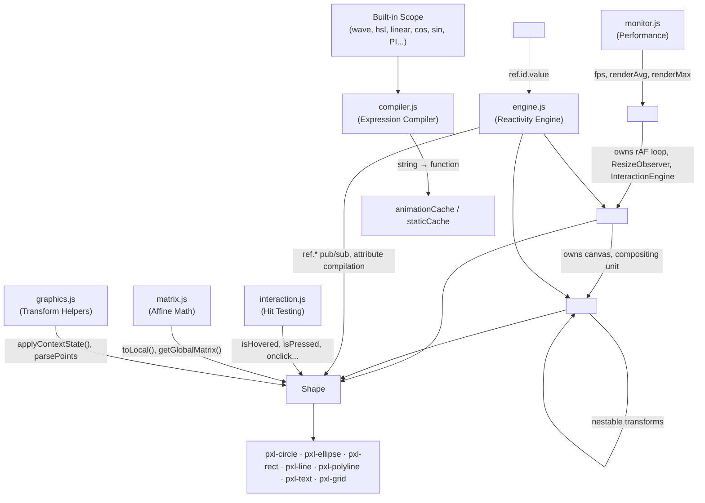

# Kilopixel Framework — Complete Technical Reference

> **Version**: 0.1.0 | **Total Source**: ~44KB minified | **Zero Dependencies** | **Zero Build Step for Users**

Kilopixel is a **declarative, reactive animation engine for HTML5 Canvas** built on Web Components. Users describe canvas scenes using custom HTML elements (`<pxl-stage>`, `<pxl-layer>`, `<pxl-circle>`, etc.) and the framework compiles, evaluates, and renders everything at 60fps automatically.

```html
<!-- Minimal working example -->
<script src="pxl.min.js"></script>
<pxl-stage id="main" ratio="16 / 9">
  <pxl-layer>
    <pxl-circle x="500" y="300" r="50" fill="red" rotate="t * 90"></pxl-circle>
  </pxl-layer>
</pxl-stage>
```

---

## Table of Contents

1. [Architecture Overview](#architecture-overview)
2. [Source Files](#source-files)
3. [Element Hierarchy & Inheritance](#element-hierarchy--inheritance)
4. [The Expression Compiler](#the-expression-compiler)
5. [The Reactivity Engine](#the-reactivity-engine)
6. [Coordinate System & Transform Pipeline](#coordinate-system--transform-pipeline)
7. [The Responsive Unit System](#the-responsive-unit-system)
8. [Color & Gradient System](#color--gradient-system)
9. [Time Drivers](#time-drivers)
10. [Interaction System](#interaction-system)
11. [Matrix Engine & Coordinate Mapping](#matrix-engine--coordinate-mapping)
12. [Element Reference — Stage](#element-reference--stage)
13. [Element Reference — Layer](#element-reference--layer)
14. [Element Reference — Group](#element-reference--group)
15. [Element Reference — Shape (Base Class)](#element-reference--shape-base-class)
16. [Element Reference — Circle](#element-reference--circle)
17. [Element Reference — Ellipse](#element-reference--ellipse)
18. [Element Reference — Rect](#element-reference--rect)
19. [Element Reference — Line](#element-reference--line)
20. [Element Reference — Polyline](#element-reference--polyline)
21. [Element Reference — Text](#element-reference--text)
22. [Element Reference — Grid](#element-reference--grid)
23. [Element Reference — Variable](#element-reference--variable)
24. [Per-Frame Render Pipeline](#per-frame-render-pipeline)
25. [Performance Monitor](#performance-monitor)
26. [Build System](#build-system)
27. [AI Code Generation Guide](#ai-code-generation-guide)

---

## Architecture Overview



### Per-Frame Data Flow

```
Stage.requestRender() → requestAnimationFrame → Stage.render(t)
  ├─ Sort layers by DOM position (if dirty)
  ├─ For each layer (if isDirty):
  │   ├─ evaluateAnimations(t)  → update attributeValues, broadcast ref.*
  │   ├─ ctx.clearRect()
  │   ├─ Heartbeat: if animated → self.invalidate() (keeps rAF alive)
  │   ├─ ctx.save() + applyContextState(translate→rotate→scale→skew→offset)
  │   ├─ For each child (group/shape):
  │   │   ├─ evaluateAnimations(t)
  │   │   ├─ ctx.save() + applyContextState()
  │   │   ├─ shape.draw(ctx, u, t) → _buildPath + applyStyle
  │   │   └─ ctx.restore()
  │   └─ ctx.restore()
  ├─ Performance metrics accumulation
  ├─ interaction.process()  → hit testing, state updates, event dispatch
  └─ pxl.perf.publish()  (every 1 second)
```

---

## Source Files

The framework compiles from these files (in build order):

| # | File | Lines | Purpose |
|---|------|-------|---------|
| 1 | `js/engine.js` | 149 | Global `pxl` namespace, reactivity pub-sub, attribute compilation bridge |
| 2 | `js/matrix.js` | 116 | Zero-GC 2D affine matrix engine (Float32Array) |
| 3 | `js/compiler.js` | 258 | Multi-tier expression parser, built-in scope, time drivers |
| 4 | `js/interaction.js` | 200 | InteractionEngine class, dummy context hit testing, pointer events |
| 5 | `js/graphics.js` | 63 | Transform pipeline helper, anchor tables, points parser |
| 6 | `js/monitor.js` | 36 | Performance telemetry (fps, renderAvg, renderMax) |
| 7 | `js/elements/stage.js` | 148 | Root container, canvas host, rAF loop, resize, pointer routing |
| 8 | `js/elements/node.js` | 148 | `PxlNode` base class (extends HTMLElement), matrix tracking |
| 9 | `js/elements/layer.js` | 113 | Compositing layer, own canvas, dirty-flag rendering |
| 10 | `js/elements/group.js` | 54 | Nestable transform container, draws into parent canvas |
| 11 | `js/elements/shape.js` | 234 | Base Shape class, style application, gradient creation, arrows |
| 12 | `js/elements/shapes/circle.js` | 109 | `<pxl-circle>` — arcs, pies, donuts, arrowheads |
| 13 | `js/elements/shapes/ellipse.js` | 117 | `<pxl-ellipse>` — elliptical arcs with independent radii |
| 14 | `js/elements/shapes/rect.js` | 63 | `<pxl-rect>` — per-corner radii, 9-position anchor |
| 15 | `js/elements/shapes/line.js` | 75 | `<pxl-line>` — simple line with arrowheads |
| 16 | `js/elements/shapes/polyline.js` | 203 | `<pxl-polyline>` — per-coordinate animation, Catmull-Rom smoothing |
| 17 | `js/elements/shapes/text.js` | 205 | `<pxl-text>` — 3-tier caching, word-wrap, reveal effect |
| 18 | `js/elements/shapes/grid.js` | 127 | `<pxl-grid>` — infinite viewport-clipped grid |
| 19 | `js/elements/variable.js` | 20 | `<pxl-var>` — reactive variable element |

---

## Element Hierarchy & Inheritance

```
HTMLElement
├── Stage (pxl-stage)           — NOT a PxlNode; standalone root
└── PxlNode (abstract base)
    ├── Layer (pxl-layer)       — extends PxlNode, owns <canvas>
    ├── Group (pxl-group)       — extends PxlNode, transform container
    ├── Variable (pxl-var)      — extends PxlNode, reactive variable
    └── Shape (abstract)        — extends PxlNode, drawing + styling
        ├── Circle (pxl-circle)
        ├── Ellipse (pxl-ellipse)
        ├── Rect (pxl-rect)
        ├── Line (pxl-line)
        ├── Polyline (pxl-polyline)
        ├── Text (pxl-text)
        └── Grid (pxl-grid)
```

### PxlNode (Base Class for Layer/Group/Shape/Variable)

**Source**: `js/elements/node.js`

Every PxlNode has:
- `attributeExpressions` — compiled functions or static values for each attribute
- `attributeValues` — current evaluated values (read by render loop)
- `animatedAttributeKeys[]` — attributes that depend on `t` (evaluated every frame)
- `reactiveAttributeKeys[]` — attributes that depend on `ref.*` variables (evaluated on change)
- `isAnimated` — true if any attribute uses time-dependent expressions
- `localMatrix` / `globalMatrix` — lazy Float32Array affine matrices
- `parentLayer` — reference to closest `<pxl-layer>` ancestor
- `parentContainer` — reference to closest `<pxl-group>` or `<pxl-layer>` parent

**Key Methods**:
- `attributeChangedCallback(name, old, new)` — compiles attribute via `pxl.compileAttribute()`, broadcasts ref changes, invalidates layer
- `connectedCallback()` — finds parentLayer/parentContainer, registers child, restores subscriptions, registers in `pxl.nodes` if has `id`
- `disconnectedCallback()` — removes from `pxl.nodes`, clears subscriptions, unregisters from parent
- `variableChangedCallback(varName)` — re-evaluates reactive attributes for a changed variable, unsubscribes if no longer needed
- `evaluateAnimations(t)` — iterates `animatedAttributeKeys`, calls expression functions with time, broadcasts ref changes if values changed, marks local matrix dirty on transform changes
- `getLocalMatrix()` / `getGlobalMatrix()` — lazy versioned matrix computation with parent chain walking

**The `attributeValues` Object**:
Has two hidden (non-enumerable) properties:
- `set(key, value)` — calls `this.setAttribute(key, value)` on the element. Used by imperative event handlers: `ref.myVar.set('value', 100)`
- `$node` — back-reference to the DOM element itself

---

## The Expression Compiler

**Source**: `js/compiler.js`

### Compilation Pipeline

The compiler uses a progressive "Fast Path" classification system. Static strings are intercepted early to avoid any runtime cost. The pipeline (in order):

1. **Hex Colors** (`#ff0000`, `#fff`) → returned as-is (zero cost)
2. **Template Literals** (`` `...` ``) → always compiled dynamically
3. **Alphabetical Words** — sub-checks:
   - Pure alphabetical (`/^[a-zA-Z\s]+$/`) → returned as string (e.g. `"red"`, `"none"`)
   - Exception: `"t"` → compiled as time expression
   - Exception: `"true"` / `"false"` → boolean
   - Exception: Math constants like `"PI"` → numeric value from scope
   - Static CSS color functions (`rgb(...)`, `hsl(...)` with only numbers) → returned as string
   - Static CSS filters (`blur(...)`, `drop-shadow(...)`) → returned as string
4. **Quoted String Literals** (`'Hello World'`) → inner string extracted
5. **Pure Numbers** (`"100"`, `"-50"`, `"0.25"`) → parsed to Number
6. **Math/Animation Guard** — regex detects `t`, `ref.`, `toLocal(`, operators, parentheses → compiled

### Expression Compilation (`compileExpression`)

When a string reaches this stage:

1. **Cache lookup** — checks `staticCache` and `animationCache` Maps first
2. **CSS % sanitizer** — converts illegal JS percentages: `50%` → `'50%'`
3. **Optional chaining injector** — converts `ref.player.x` → `ref.player?.x` (prevents TypeError before elements connect)
4. **toLocal rewriter** — converts `toLocal(` → `pxl.mapCoordinate(this, `
5. **Time dependency check** — regex tests for `t` (not preceded by `.`) or any driver function name
6. **Variable dependency extraction** — regex extracts all `ref.xxx` identifiers
7. **Smart return detector** — if no `return` keyword, wraps in `return ...;`

Then branches:

**Animation Path** (has time dependency or variable refs):
```javascript
const fn = new Function('scope', 'ref', `
  const { PI, sin, cos, wave, ... } = scope;
  let t;
  const loop = (d) => (t % d) / d;
  const wave = (d) => 0.5 - cos((t / d) * PI * 2) * 0.5;
  // ... all 8 time drivers
  return function(_t) {
    t = _t;
    return <user expression>;
  };
`)(pxl.scope, pxl.nodes);
```

The outer function (factory) executes ONCE, destructuring the entire scope. The inner function (closure) executes every frame, receiving only `_t`.

**Properties added to the function**:
- `fn.isTimeDependent` — true if uses `t` or time drivers or `this`
- `fn.variableDependencies` — array of `ref.xxx` strings (if any)

**Static Path** (no time, no variables):
Evaluated once via `new Function`, result cached in `staticCache`.

### No `Math.` Prefix Required (Top-Level Scope Injection)

All standard JavaScript `Math` constants and methods (`PI`, `cos`, `sin`, `abs`, `min`, `max`, `pow`, `round`, etc.) are injected directly into every compiled expression's top-level scope.

> [!IMPORTANT]
> **Never use the `Math.` prefix** inside declarative expressions. Write `cos(t)` and `sin(t)` directly instead of `Math.cos(t)` or `Math.sin(t)`.

### Smart Return

The compiler auto-wraps expressions in `return` unless the string already contains the `return` keyword. This enables two syntax modes:
- **Simple expressions**: `t > 1000 ? 'red' : 'blue'` (auto-wrapped)
- **Full code blocks**: `if (t < 1000) { return 'red'; } else { return 'blue'; }`

### Self-Referencing with `this`

Expressions containing `this` are flagged as `isTimeDependent = true` (animated), because the function is called with `fn.call(element, t)`. This gives the expression access to `this.attributeValues`, `this.id`, etc.

```html
<pxl-circle r="30 + wave(2)*70" fill="`hsl(${this.attributeValues.r * 3}, 100%, 50%)`"></pxl-circle>
```

---

## The Reactivity Engine

**Source**: `js/engine.js`

### Core Architecture

- **`pxl.nodes`** — a flat `{}` registry mapping element `id` → `attributeValues` object. When any element with an `id` connects to the DOM, it registers: `pxl.nodes[myId] = this.attributeValues`
- **`pxl._subscriptions`** — a `{ fullKey: [element, element, ...] }` pub-sub map
- **`pxl.broadcast(fullKey)`** — iterates subscribers backwards (safe for in-place removal), calling `element.variableChangedCallback(fullKey)`

### Attribute Classification (Three Tiers)

When `pxl.compileAttribute(element, name, value)` is called:

| Result Type | Storage | Evaluation |
|-------------|---------|------------|
| **Static** (number, string, boolean) | `attributeValues[name] = value` | Never re-evaluated |
| **Time-Dependent Function** (`fn.isTimeDependent = true`) | Added to `animatedAttributeKeys[]` | Every frame via `evaluateAnimations(t)` |
| **Reactive Function** (has `variableDependencies` but no time) | Added to `reactiveAttributeKeys[]` | Only when referenced variable broadcasts |

### Variable Change Propagation

```
pxl.broadcast('ref.myVar')
  → for each subscriber element (backwards):
      → element.variableChangedCallback('ref.myVar')
        → pxl.evaluateAttributesForVariable(element, 'ref.myVar')
          → re-evaluate all reactive attributes that depend on 'ref.myVar'
          → returns bitmask: bit 1 = var still needed, bit 2 = values changed
        → if bit 1 is 0: unsubscribe (self-cleaning)
        → if bit 2 is 1: broadcast own ref key + invalidate layer
```

### The `ref.*` Namespace

All reactive references use a flat `ref.` prefix:
- `ref.myCircle.x` — reads `pxl.nodes['myCircle'].x` (the circle's current x value)
- `ref.main.mouseX` — reads the stage's mouse X coordinate
- `ref.speed.value` — reads a `<pxl-var id="speed">` element's value
- `ref.btn.isHovered` — reads a shape's hover state

The optional chaining injector ensures `ref.player?.x` so unresolved refs return `undefined` instead of throwing.

> [!WARNING]
> **Why Canvas Target IDs Must Not Use Kebab-Case (`-`)**
> Never use hyphens (`kebab-case`) in IDs for `<pxl-layer>`, `<pxl-var>`, or any shape element that will be referenced by `ref.*` in declarative expressions. Because hyphens are subtraction operators in JavaScript, writing `ref.ex4-layer.x` throws a JavaScript syntax error (`(ref.ex4) - (layer.x)`). Always use **`camelCase`** (`id="ex4Layer"`, `id="orbitSpeed"`) for elements referenced by `ref.*`.

---

## Coordinate System & Transform Pipeline

### Center + Offset Architecture

Every element (layer, group, shape) has this coordinate model:

- **`x`, `y`** — The **Center** of the element. All transforms (rotation, scaling, skewing) occur around this point. When `dx`/`dy` offsets are applied, the shape is visually displaced but `x`/`y` remains the transform origin.
- **`dx`, `dy`** — A **Local Offset** applied *after* rotation and scaling. Shifts where the shape is drawn without moving its center of transformation. This allows orbiting without changing the rotation center.

### Transform Pipeline Order

Applied by `pxl.applyContextState()` in this exact order:

```
1. ctx.translate(x * u, y * u)      ← Move to center (transform origin)
2. ctx.rotate(rotate * π/180)        ← Rotate around pivot
3. ctx.scale(scalex, scaley)         ← Scale around center
4. ctx.transform(1, skewy, skewx, 1) ← Skew
5. ctx.translate(dx * u, dy * u)     ← Offset AFTER rotation/scale
6. ctx.globalAlpha *= alpha           ← Compound opacity
7. ctx.globalCompositeOperation       ← Blend mode
8. ctx.filter                         ← CSS filter
```

**Scale Resolution & Symmetry Guarantee**: Uniform scaling uses `scale="..."` (applying identically to both axes), while non-uniform scaling uses `scalex="..."` and/or `scaley="..."`. **Do not combine both on the same element.** If this rule is broken and `scale` is applied alongside `scalex` or `scaley`, `scale` strictly overrides the individual axis multipliers (`scale !== 1 ? scale : scalex`). This guarantees that whenever a uniform `scale` attribute is set, the element transforms with 100% geometric symmetry and safe aspect-ratio preservation.

### Why This Matters

The center/offset split makes orbital motion trivial:

```html
<!-- Planet orbiting center at 60°/sec, 200-unit orbital radius -->
<pxl-circle x="500" y="300" dx="200" rotate="t * 60" r="20" fill="red"></pxl-circle>
```

Without this split, you'd need nested groups or trigonometry.

### Shape Drawing Origin

Shapes are drawn relative to `(0, 0)` within the transformed context. The transform pipeline has already positioned the canvas context at the shape's center. For example, a circle draws `ctx.arc(0, 0, r * u, ...)`.

---

### Style Cascade & Inheritance (`alpha`, `blend`, `filter`, and native shadows)

All container styling attributes (`alpha`, `blend`, `filter`, and native canvas shadows `shadowcolor`, `shadowblur`, `shadowx`, `shadowy`) cascade through the element hierarchy from `<pxl-layer>` down to child `<pxl-shape>` elements:

- **Compounding Opacity (`alpha`)**: Opacity multiplies mathematically down the container tree (`ctx.globalAlpha *= alpha`). 
- **Inherited Blend Modes, Filters, and Native Shadows**: The `<pxl-layer>` sets the rendering state on the canvas context (`ctx.globalCompositeOperation`, `ctx.filter`, `ctx.shadowColor`, `ctx.shadowBlur`, `ctx.shadowOffsetX`, `ctx.shadowOffsetY`) before drawing its children. All child shapes automatically inherit these styles.
- **Overriding and Disabling Styles**: Any child shape can override an inherited style by setting its own value (e.g. `shadowcolor="#ef4444"`), or explicitly disable an inherited filter or shadow by setting `filter="none"` or `shadowcolor="none"` / `shadowcolor="transparent"`.
- **Zero-Inheritance Groups**: Note that `<pxl-group>` is a **Pure Spatial Transform & Structural Container** and does *not* support or cascade styling attributes. This enforces a clean 3-tier architecture (`Layer` -> `Group` -> `Shape`) with zero DOM style inheritance overhead for groups.

---

## The Responsive Unit System

- **Logical width**: Always **1000** (hardcoded)
- **Unit `u`**: `clientWidth / 1000` — the scaling factor
- **Logical height**: Dynamic, calculated as `clientHeight / u`
- All spatial values (x, y, dx, dy, r, w, h, strokewidth, etc.) are multiplied by `u` at draw time
- **DPI awareness**: Canvas is scaled by `devicePixelRatio` via ResizeObserver

This means:
- `x="500"` is always horizontal center
- `x="0"` is always left edge, `x="1000"` is always right edge
- The same code works at 50×50px and 4K resolution

**Performance implication**: Because the logical width is fixed at 1000, raw numbers like `x="500"` hit the compiler's Fast Path (just a number, zero evaluation cost). Prefer `x="500"` over `x="ref.main.width / 2"`.

---

## Color & Gradient System

### Color Functions (Scope Injected)

These are JavaScript functions in the compiler's scope, **not** CSS. They return strings:

```javascript
rgb(r, g, b)       → "rgb(r,g,b)"
rgba(r, g, b, a)   → "rgba(r,g,b,a)"
hsl(h, s, l)       → "hsl(h,s%,l%)"      // numbers auto-get '%' suffix
hsla(h, s, l, a)   → "hsla(h,s%,l%,a)"
```

Because they contain parentheses, the compiler automatically routes them through the expression path (not the static Fast Path). They are safely re-evaluated at 60fps.

### Gradient Descriptors (Deferred Creation)

`linear()` and `radial()` return lightweight **descriptor objects**, not `CanvasGradient` instances. The actual gradient is created at draw time by `shape.createGradient()` when the bounding box is known.

#### `linear(direction, colorsArray)`

**Angle mode** (number):
```html
fill="linear(45, ['red', 'blue'])"
```
The angle uses CSS-like geometry. Endpoints are calculated using `stretch = 1 / max(|cos|, |sin|)` normalization, ensuring they always reach the bounding box edges regardless of angle.

**Coordinate mode** (array):
```html
fill="linear([0, 0, 1, 1], ['red', 'blue'])"
```
Coordinates are **proportional** to the shape's bounding box. `[0, 0]` = top-left, `[1, 1]` = bottom-right.

#### `radial(radiusOrConfig, colorsArray)`

**Simple mode** (number):
```html
fill="radial(1, ['white', 'black'])"
```
`radius` of `1` stretches to the edge of the bounding box.

**Config mode** (array):
```html
fill="radial([0.5, 0.5, 1], ['white', 'black'])"
```
`[cx, cy, r]` — center coordinates (proportional) and radius.

#### Color Stop Formats

Both gradient functions accept two color stop formats:
```javascript
['red', 'blue']                    // Simple — evenly spaced
[0, 'red', 0.5, 'green', 1, 'blue'] // Offset-mapped — explicit positions
```

#### Gradient Caching

The Shape base class caches gradients via `_lastGradientConfig` and `_lastGradientU`. If the descriptor object reference and unit haven't changed, the cached `CanvasGradient` is reused.

---

## Unified Responsive Filters

Kilopixel provides a unified API for CSS and Canvas filters that mirrors the Gradient architecture, accessible natively via `pxl.scope`.

### Usage

Filters are invoked as standard function calls rather than raw string concatenation. They can be applied individually or chained using an array.

**Single Filter**:
```html
<pxl-layer filter="blur(5)"></pxl-layer>
```

**Chained Filters (Array)**:
```html
<pxl-shape filter="[blur(10), contrast(150), saturate(200)]"></pxl-shape>
```

### Available Filter Helpers

| Function | Output | Description |
| :--- | :--- | :--- |
| `blur(radius)` | `blur(...)` | `radius` is automatically scaled by `u`. |
| `dropShadow(x, y, blur, color)` | `drop-shadow(...)` | `x`, `y`, `blur` are scaled by `u`. Defaults to `#000` if no color provided. |
| `brightness(val)` | `brightness(...)` | Uses percentage (`val`%). |
| `contrast(val)` | `contrast(...)` | Uses percentage (`val`%). |
| `hueRotate(deg)` | `hue-rotate(...)` | Uses degrees (`deg`deg). |
| `invert(val)` | `invert(...)` | Uses percentage (`val`%). |
| `saturate(val)` | `saturate(...)` | Uses percentage (`val`%). |
| `grayscale(val)` | `grayscale(...)` | Uses percentage (`val`%). |
| `sepia(val)` | `sepia(...)` | Uses percentage (`val`%). |
| `opacity(val)` | `opacity(...)` | Uses percentage (`val`%). |

> [!IMPORTANT]
> **No Units Required**: Do not provide `px`, `%`, or `deg` manually! The scope helpers automatically append the correct units (`blur(5)` → `blur(5px)`). Kilopixel's graphics pipeline automatically detects pixel values and multiplies them by the physical scaling factor (`u`) before drawing.

---

## Time Drivers

All 8 time drivers are defined in `pxl.drivers` and injected into every compiled expression's scope. The variable `t` is in **seconds** (not milliseconds). Each driver takes a `d` parameter (duration/period in seconds) and returns a value in the `[0, 1]` range.

| Driver | Formula | Behavior |
|--------|---------|----------|
| `loop(d)` | `(t % d) / d` | Linear sawtooth, 0→1 repeating |
| `yoyo(d)` | `1 - abs((t % (d*2)) / d - 1)` | Linear ping-pong, 0→1→0 |
| `wave(d)` | `0.5 - cos((t/d) * PI * 2) * 0.5` | Smooth sinusoidal, 0→1→0 |
| `bounce(d)` | `abs(sin((t/d) * PI))` | Absolute sine, bouncing ball |
| `strobe(d)` | `t % d < d*0.5 ? 1 : 0` | Binary on/off toggle |
| `glide(d)` | `l*l*(3-2*l)` where `l = (t%d)/d` | Smooth ease-in-out (Hermite) |
| `pulse(d)` | `pow(sin((t/d) * PI), 6)` | Sharp spike pulse |
| `glitch(d)` | `abs(sin(floor(t/d) * 437.58)) % 1` | Pseudo-random stepped values |

**Usage**: All return 0-1. Multiply to scale, add to offset:
```html
r="30 + wave(2) * 70"           <!-- radius oscillates between 30 and 100 over 2 seconds -->
fill="hsl(loop(5) * 360, 80, 50)"  <!-- hue cycles through rainbow every 5 seconds -->
```

---

## Interaction System

**Source**: `js/interaction.js`

### Dual Architecture

The framework exposes interactions via two complementary systems:

#### 1. Declarative States (for styling/expressions)

Automatically updated boolean properties on shape elements:
- `isHovered` — true while pointer is over the element
- `isPressed` — true while pointer is held down on the element

```html
<pxl-rect id="btn" w="100" h="40"
  fill="ref.btn.isPressed ? '#333' : (ref.btn.isHovered ? '#666' : '#999')"
  scale="ref.btn.isPressed ? 0.95 : (ref.btn.isHovered ? 1.05 : 1)"></pxl-rect>
```

#### 2. Imperative Events (for logic/scripting)

Instantaneous JavaScript blocks compiled and attached to elements:
- `onclick` — pointer click
- `onenter` — pointer enters element
- `onleave` — pointer leaves element
- `ondown` — pointer press starts
- `onup` — pointer press ends
- `onmove` — pointer moves while over element

```html
<pxl-circle onclick="ref.counter.set('value', ref.counter.value + 1)" ...></pxl-circle>
```

**Event compilation**: Event strings are compiled via `new Function` with the full scope (including `ref`, all math functions, all drivers). They are bound to the element via `.bind(this)`.

### Hit Testing Algorithm

The framework uses a **dummy canvas context** (`pxl.dummyCtx`) with intercepted `fill()` and `stroke()` methods:

1. A 1×1 off-screen canvas is created at module load
2. Its `fill` method is overridden to call `isPointInPath(hitX, hitY)`
3. Its `stroke` method is overridden to call `isPointInStroke(hitX, hitY)`
4. During hit testing, the engine:
   - Iterates interactive elements in **reverse DOM order** (front-to-back)
   - Walks the parent chain to build the transform stack
   - Applies all transforms to the dummy context
   - Calls the shape's `draw()` method on the dummy context
   - The intercepted fill/stroke methods check if the mouse point is inside
   - First hit wins (topmost element)

This reuses the shape's own `draw()` method for pixel-perfect mathematical hit testing without any separate collision geometry.

### InteractionEngine Lifecycle

- Elements with event handlers (`onclick`, `onenter`, etc.) or that use `isHovered`/`isPressed` in expressions are registered with `stage.interaction.registerElement(el)`
- Pointer events (`pointermove`, `pointerdown`, `pointerup`, `click`, `pointerenter`, `pointerleave`) are handled by the InteractionEngine via `handleEvent()`
- Hit testing runs in `process()`, called at the end of each `stage.render()`
- Mouse coordinates are converted to logical units: `offsetX / stage.unit`
- Interactive elements automatically set `stage.style.cursor = 'pointer'` on hover, resetting to `''` when no interactive element is hovered

---

## Matrix Engine & Coordinate Mapping

**Source**: `js/matrix.js`

### Zero-GC Affine Matrix

`pxl.Matrix` is a namespace of static functions that operate on `Float32Array(6)` matrices `[a, b, c, d, tx, ty]`:

- `create()` → identity Float32Array
- `updateLocal(out, x, y, dx, dy, rotate, scalex, scaley, skewx, skewy)` → builds local transform
- `multiply(out, a, b)` → `out = a * b`
- `invert(out, a)` → `out = a⁻¹` (with degenerate fallback to identity)

Three pre-allocated scratch matrices prevent GC pressure:
- `pxl._scratchMatrixA`
- `pxl._scratchMatrixB`
- `pxl._identityMatrix`

### Lazy Versioned Matrix Tracking

Each PxlNode tracks matrix state to avoid recomputation:
- `_isLocalMatrixDirty` — boolean flag, set true when transform attributes change
- `_globalMatrixVersion` — increments when local or parent matrix changes
- `_parentMatrixVersion` — tracks parent's version for dirty detection

`getGlobalMatrix()` recursively walks the parent chain, only recomputing when version mismatches are detected.

### Coordinate Mapping (`toLocal`)

The `toLocal(target, property)` function maps a target element's global position into the caller's local coordinate space:

```html
<pxl-circle x="toLocal(ref.player, 'x')" y="toLocal(ref.player, 'y')"></pxl-circle>
```

**Algorithm** (`pxl.mapCoordinate`):
1. Get the caller's parent's global matrix
2. Get the target's global matrix
3. Compute: `Delta = Invert(CallerParentGlobal) × TargetGlobal`
4. Extract the requested property from the delta matrix:
   - `'x'` → `delta[4]` (translation X of Hinge Origin)
   - `'y'` → `delta[5]` (translation Y of Hinge Origin)
   - `'dx'` / `'dy'` → offset vector components `(tdx, tdy)` rotated and scaled in caller space
   - `'tx'` / `'ty'` → total physical screen coordinate (`x + dx`, `y + dy`) in caller space
   - `'rotate'` → `atan2(delta[1], delta[0])` in degrees
   - `'scale'` / `'scalex'` → `sqrt(delta[0]² + delta[1]²)`
   - `'scaley'` → `sqrt(delta[2]² + delta[3]²)`

Note: The compiler rewrites `toLocal(` to `pxl.mapCoordinate(this, ` at compile time.

---

## Element Reference — Stage

**Tag**: `<pxl-stage>`  
**Class**: `Stage extends HTMLElement`  
**Source**: `js/elements/stage.js`

> Note: Stage does NOT extend PxlNode. It is a standalone root container.

### Observed Attributes

| Attribute | Default | Description |
|-----------|---------|-------------|
| `ratio` | `16 / 9` | Sets CSS `aspect-ratio`. Parsed through the expression compiler, so math like `10 / 3` works. |

### Built-in `attributeValues` (Published via `ref.stageId.*`)

| Property | Type | Description |
|----------|------|-------------|
| `mouseX` | number | Pointer X in logical coordinates (0-1000). Default: 500 |
| `mouseY` | number | Pointer Y in logical coordinates. Default: 500 |
| `isHovered` | boolean | True when pointer is over the stage |
| `width` | number | Always 1000 (fixed logical width) |
| `height` | number | Dynamic, based on aspect ratio (`clientHeight / unit`) |
| `fps` | number | Frames rendered in last second |
| `renderAvg` | string | Average ms per frame (2 decimal places) |
| `renderMax` | string | Worst frame ms in last second (2 decimal places) |

### Key Behavior

- Creates no shadow DOM or internal canvas — layers each create their own
- Sets `display: block`, `position: relative`, `width: 100%` on connect
- `ResizeObserver` with `device-pixel-content-box` (fallback to `content-box`)
- `unit = clientWidth / 1000`
- Manages `layers[]` array, sorts by DOM position when dirty
- Only renders dirty layers: `if (layer.isDirty) layer.render(u, t)`
- Delegates all pointer events to its `InteractionEngine`
- Registers with `pxl.perf` for telemetry
- Supports multiple independent stages per page

---

## Element Reference — Layer

**Tag**: `<pxl-layer>`  
**Class**: `Layer extends PxlNode`  
**Source**: `js/elements/layer.js`

### Observed Attributes (18)

`x`, `y`, `dx`, `dy`, `rotate`, `scale`, `scalex`, `scaley`, `skewx`, `skewy`, `alpha`, `blend`, `filter`, `shadowcolor`, `shadowblur`, `shadowx`, `shadowy`, `hidden`

### Default Values

```javascript
{ x: 0, y: 0, dx: 0, dy: 0, rotate: 0, scale: 1, scalex: 1, scaley: 1,
  skewx: 0, skewy: 0, alpha: 1, blend: 'source-over', filter: 'none',
  shadowcolor: null, shadowblur: 0, shadowx: 0, shadowy: 0, hidden: false }
```

### Key Behavior

- Each layer creates its own `<canvas>` element, absolutely positioned over the stage
- `isDirty` flag controls whether the layer re-renders
- `isCanvasEmpty` tracks whether the canvas was just cleared (optimization for hidden layers)
- `invalidate()` sets `isDirty = true` and calls `stage.requestRender()`
- Hidden optimization: if `hidden` AND `isCanvasEmpty`, skip even the `requestRender()` call
- On render: evaluates animations, clears canvas, applies transforms, iterates `childList`
- Children (groups and shapes) sorted by DOM position when `isOrderDirty`
- `resize(w, h, dpr)` — called by stage, resizes canvas to physical pixels, scales context by DPR

---

## Element Reference — Group

**Tag**: `<pxl-group>`  
**Class**: `Group extends PxlNode`  
**Source**: `js/elements/group.js`

> [!NOTE]
> **Pure Spatial Transform Container**  
> `<pxl-group>` is a lightweight container dedicated exclusively to structural grouping and geometric transforms. It does NOT support bitmap compositing (`alpha`, `blend`, `filter`, `shadow*`). For compositing, use `<pxl-layer>` or apply the attributes directly to leaf shapes.

### Observed Attributes (11)

Same geometric transforms as Layer: `x`, `y`, `dx`, `dy`, `rotate`, `scale`, `scalex`, `scaley`, `skewx`, `skewy`, `hidden`

### Key Behavior

- Does NOT own a canvas — draws into parent layer's context
- Groups can nest infinitely, each adding transforms to the stack
- `render(ctx, u, t)` evaluates animations, applies transforms, iterates children
- Only saves/restores context if there are actual transform changes (optimization)

---

## Element Reference — Shape (Base Class)

**Tag**: N/A (abstract)  
**Class**: `Shape extends PxlNode`  
**Source**: `js/elements/shape.js`

### Observed Attributes (32)

**Transform**: `x`, `y`, `dx`, `dy`, `rotate`, `scale`, `scalex`, `scaley`, `skewx`, `skewy`  
**Style**: `fill`, `stroke`, `strokewidth`, `linecap`, `linejoin`, `miterlimit`, `linedash`, `dashoffset`  
**Render**: `alpha`, `blend`, `filter`, `shadowcolor`, `shadowblur`, `shadowx`, `shadowy`, `hidden`  
**Events**: `onclick`, `onenter`, `onleave`, `ondown`, `onup`, `onmove`

### Default Values

```javascript
{ x: 0, y: 0, dx: 0, dy: 0, fill: null, stroke: null, strokewidth: 1,
  linecap: 'butt', linejoin: 'miter', miterlimit: 10, linedash: null,
  dashoffset: 0, rotate: 0, scale: 1, scalex: 1, scaley: 1,
  skewx: 0, skewy: 0, alpha: 1, blend: 'source-over', filter: 'none',
  shadowcolor: null, shadowblur: 0, shadowx: 0, shadowy: 0,
  hidden: false, isHovered: false, isPressed: false }
```

### Key Methods

**`render(ctx, u, t)`**: Evaluates animations, checks hidden, applies transform pipeline (save/restore only if needed), calls `this.draw(ctx, u, t)`.

**`applyStyle(ctx, u)`**: After a path is built:
1. If `fill` is set (not `none`/`transparent`): resolve gradient, `ctx.fill()`
2. If `stroke` is set and `strokewidth > 0`: resolve gradient, set lineWidth/lineCap/lineJoin/miterLimit/lineDash, `ctx.stroke()`

**`createGradient(ctx, u, styleValue)`**: If the value is a gradient descriptor (has `isGradient: true`), creates a `CanvasGradient` from the shape's bounding box. Uses `_lastGradientConfig` cache to avoid recreation.

**`createLineDash(u, linedash)`**: Scales dash array by `u` into pre-allocated `_scaledDash[]`.

**`drawArrow(ctx, u, tipX, tipY, tangent, size, style)`**: Draws arrowhead at a point with given tangent angle. Two styles:
- `'filled'` — solid triangle, fills with strokeStyle
- `'line'` — open V-shape, stroked

### Event Handling

When `attributeChangedCallback` receives an event attribute (`onclick`, `onenter`, etc.):
1. The string is sanitized (ref optional chaining injected)
2. Compiled via `new Function` with full scope access
3. Bound to the element via `.bind(this)`
4. Stored in `_compiledOnClick`, `_compiledOnEnter`, etc.
5. Element is registered with `stage.interaction`

---

## Element Reference — Circle

**Tag**: `<pxl-circle>`  
**Class**: `Circle extends Shape`  
**Source**: `js/elements/shapes/circle.js`

### Additional Observed Attributes

`r`, `ir`, `start`, `end`, `sweep`, `pie`, `anticlockwise`, `arrowstart`, `arrowend`, `arrowstyle`

### Additional Defaults

```javascript
{ r: 0, ir: 0, start: 0, end: null, sweep: null, pie: false,
  anticlockwise: false, arrowstart: 0, arrowend: 0, arrowstyle: 'filled' }
```

### Attribute Details

| Attribute | Type | Description |
|-----------|------|-------------|
| `r` | number | Outer radius |
| `ir` | number | Inner radius (creates donut/ring when > 0) |
| `start` | number | Arc start angle in degrees |
| `end` | number | Arc end angle in degrees (absolute) |
| `sweep` | number | Arc sweep angle in degrees (relative to start). Takes priority over `end`. |
| `pie` | boolean | If true, draws lines from arc endpoints to center (pie slice) |
| `anticlockwise` | boolean | Reverses arc direction |
| `arrowstart` | number/`'auto'` | Arrowhead size at start of arc. `'auto'` = `strokewidth * 3.6` |
| `arrowend` | number/`'auto'` | Arrowhead size at end of arc |
| `arrowstyle` | `'filled'`/`'line'` | Arrow rendering style |

### Drawing Logic

- Calculates start/end radians from degrees
- If `sweep` is set, `endRadians = startRadians + sweep * π/180`
- If neither `end` nor `sweep`, draws full circle
- Arrow offset interception: if arrows are enabled, the arc endpoints are pulled back to prevent overlap
- Donut: if `ir > 0`, draws inner arc in reverse direction and closes
- Pie: if `pie` and not full circle, draws `lineTo(0, 0)` and closes

### Bounding Box

`{ left: -r, right: r, top: -r, bottom: r }`

---

## Element Reference — Ellipse

**Tag**: `<pxl-ellipse>`  
**Class**: `Ellipse extends Shape`  
**Source**: `js/elements/shapes/ellipse.js`

### Additional Observed Attributes

`rx`, `ry`, `irx`, `iry`, `start`, `end`, `sweep`, `pie`, `anticlockwise`, `arrowstart`, `arrowend`, `arrowstyle`

### Additional Defaults

```javascript
{ rx: 0, ry: 0, irx: 0, iry: 0, start: 0, end: null, sweep: null,
  pie: false, anticlockwise: false, arrowstart: 0, arrowend: 0, arrowstyle: 'filled' }
```

### Drawing Logic

Like Circle but uses `ctx.ellipse()` with independent `rx`/`ry` radii. Arrow angle calculations use the parametric derivative of the ellipse for correct tangent computation:
```javascript
dx = -rx * sin(angle)
dy = ry * cos(angle)
speed = sqrt(dx² + dy²)
```

### Bounding Box

`{ left: -rx, right: rx, top: -ry, bottom: ry }`

---

## Element Reference — Rect

**Tag**: `<pxl-rect>`  
**Class**: `Rect extends Shape`  
**Source**: `js/elements/shapes/rect.js`

### Additional Observed Attributes

`w`, `h`, `r`, `r1`, `r2`, `r3`, `r4`, `anchor`

### Additional Defaults

```javascript
{ w: 0, h: 0, r: null, r1: null, r2: null, r3: null, r4: null, anchor: 'center' }
```

### Attribute Details

| Attribute | Type | Description |
|-----------|------|-------------|
| `w` | number | Width |
| `h` | number | Height |
| `r` | number | Universal corner radius (all 4 corners) |
| `r1`-`r4` | number | Per-corner radius overrides (top-left, top-right, bottom-right, bottom-left). Falls back to `r`. |
| `anchor` | string | Position anchor. One of 9 positions. |

### Anchor System

The anchor shifts the drawing origin relative to the rect's bounding box:

| Anchor | Effect |
|--------|--------|
| `center` (default) | Rect centered on x/y |
| `top-left` | Rect's top-left corner at x/y |
| `top` | Rect's top-center at x/y |
| `top-right` | Top-right corner at x/y |
| `left` | Left-center at x/y |
| `right` | Right-center at x/y |
| `bottom-left` | Bottom-left at x/y |
| `bottom` | Bottom-center at x/y |
| `bottom-right` | Bottom-right at x/y |

Internally uses lookup tables: `pxl.anchorX` and `pxl.anchorY` mapping names to 0 / 0.5 / 1 proportions.

### Drawing Logic

- Calculates `startX = -w * anchorX * u`, `startY = -h * anchorY * u`
- If any corner radius > 0: uses `ctx.roundRect()` (with fallback to `ctx.rect()`)
- Pre-allocated `_radii = [0,0,0,0]` array for zero-GC roundRect

### Bounding Box

Takes anchor into account: `{ left: -w*ax, right: w*(1-ax), top: -h*ay, bottom: h*(1-ay) }`

---

## Element Reference — Line

**Tag**: `<pxl-line>`  
**Class**: `Line extends Shape`  
**Source**: `js/elements/shapes/line.js`

### Additional Observed Attributes

`x1`, `y1`, `x2`, `y2`, `arrowstart`, `arrowend`, `arrowstyle`

### Additional Defaults

```javascript
{ x1: 0, y1: 0, x2: 0, y2: 0, arrowstart: 0, arrowend: 0, arrowstyle: 'filled' }
```

### Drawing Logic

- Fast path: if no arrows, simple `moveTo` + `lineTo` + `applyStyle`
- With arrows: calculates tangent angles, offsets line endpoints for filled arrows (0.75× arrow size), handles square linecap offset
- Arrow size: number for explicit size, `'auto'` = `strokewidth * 3.6`

### Bounding Box

```javascript
{ left: min(x1,x2), right: max(x1,x2), top: min(y1,y2), bottom: max(y1,y2) }
```

---

## Element Reference — Polyline

**Tag**: `<pxl-polyline>`  
**Class**: `Polyline extends Shape`  
**Source**: `js/elements/shapes/polyline.js`

### Additional Observed Attributes

`points`, `closed`, `smooth`, `mode`, `arrowstart`, `arrowend`, `arrowstyle`

### Additional Defaults

```javascript
{ closed: false, smooth: false, mode: 'absolute', arrowstart: 0, arrowend: 0, arrowstyle: 'filled' }
```

### Points Syntax

Points are separated by **semicolons**, X/Y by **commas**. Each coordinate can be an independent expression:

```html
points="0,0; 100,wave(2)*50; 200,0"
```

The parser (`pxl.parsePointsIntoArray`) is parenthesis-aware, so functions like `min(a, b)` work within coordinates.

### Per-Coordinate Animation

When `points` attribute changes:
1. `clearPoints()` removes all synthetic `p0`, `p1`, `p2`... keys
2. `pxl.parsePointsIntoArray()` splits into individual coordinate strings
3. Each coordinate is compiled independently as `pxl.compileAttribute(this, 'p0', coordString)`
4. At draw time, `flatCache[i] = attributeValues[pointKeys[i]] * u`

This means each X and Y coordinate can have its own independent animation expression.

### Smoothing

When `smooth` is not false:
- Uses **Catmull-Rom** spline interpolation via `ctx.bezierCurveTo()`
- `smooth` can be a number to control tension (default `1` when truthy)
- Control points: `cp = p + (pNext - pPrev) * (tension / 6)`
- Handles both open and closed polylines correctly

### Modes

- `mode="absolute"` (default) — coordinates are absolute
- `mode="relative"` — each point is relative to the previous (accumulated: `flatCache[i] += flatCache[i-2]`)

### Drawing Logic

- Minimum 4 values (2 points) required
- Fills `flatCache` Float32Array with scaled values
- If arrows: intercepts start/end points, offsets them, caches originals for restoration after draw
- Draws path: simple `lineTo` or smooth `bezierCurveTo`
- If `closed`: `ctx.closePath()`

### Bounding Box

Iterates all point values (handling relative mode accumulation) to find min/max X/Y.

---

## Element Reference — Text

**Tag**: `<pxl-text>`  
**Class**: `Text extends Shape`  
**Source**: `js/elements/shapes/text.js`

### Additional Observed Attributes

`text`, `size`, `font`, `align`, `baseline`, `weight`, `fontstyle`, `maxwidth`, `direction`, `width`, `lineheight`, `letterspacing`, `reveal`

### Additional Defaults

```javascript
{ text: '', size: 16, font: 'sans-serif', align: 'start',
  baseline: 'alphabetic', weight: 'normal', fontstyle: 'normal',
  maxwidth: 0, direction: null, width: 0, lineheight: 1.2,
  letterspacing: 0, reveal: null }
```

### Attribute Details

| Attribute | Type | Description |
|-----------|------|-------------|
| `text` | string/expression | Text content. Strings must be quoted in expressions: `text="'Hello'"` |
| `size` | number | Font size in logical units |
| `font` | string | Font family (e.g. `'sans-serif'`, `'monospace'`) |
| `align` | string | `'start'`, `'end'`, `'left'`, `'right'`, `'center'` |
| `baseline` | string | `'alphabetic'`, `'top'`, `'middle'`, `'bottom'`, `'hanging'`, `'ideographic'` |
| `weight` | string | `'normal'`, `'bold'`, `'100'`-`'900'` |
| `fontstyle` | string | `'normal'`, `'italic'`, `'oblique'` |
| `maxwidth` | number | Maximum width (canvas `maxWidth` parameter) |
| `width` | number | Target width for auto word-wrapping (in logical units) |
| `lineheight` | number | Line height multiplier (default `1.2`) |
| `letterspacing` | number | Letter spacing in logical units |
| `direction` | string | Text direction (`'ltr'`, `'rtl'`) |
| `reveal` | number (0-1) | Typewriter effect. `0` = hidden, `1` = fully visible. Percentage of total characters. |

### 3-Tier Caching System

**Tier 1 — Font State Cache**: Rebuilds the font string (`"normal normal 16px sans-serif"`) only when size, font, weight, fontstyle, or letterspacing change. Tracks `_lastSize`, `_lastFont`, `_lastWeight`, `_lastStyle`, `_lastLetterspacing`, `_lastU`.

**Tier 2 — Text Layout Cache**: The auto word-wrap algorithm runs only when Tier 1 is dirty OR `text`/`width` change.
- If `width > 0`: splits text into words, measures each line, wraps when exceeding `width`
- Handles explicit `\n` newlines within text
- Caches result in `_lines[]` and `_totalChars`

**Tier 3 — Bounding Box & Alignment Cache**: Recomputes metrics only when Tier 2 is dirty OR `align`/`baseline`/`lineheight`/`direction` change.
- Uses `ctx.measureText()` for pixel-accurate metrics
- Calculates `_startY` offset based on baseline

### Reveal Effect

When `reveal` is set (0 to 1):
- Characters to show: `floor(reveal * (totalChars + 1))`
- `reveal="0"` hides all text, `reveal="1"` shows all
- Lines are truncated progressively via `substring()`
- Fast-path bailout if `charsRemaining <= 0`

### Text Rendering

- Skips empty text
- Resolves fill/stroke gradients
- Iterates `_lines[]`, applies `fillText` and/or `strokeText`
- Respects `maxwidth` parameter
- `letterSpacing` is set on the context as a CSS string (e.g. `"5px"`)

---

## Element Reference — Grid

**Tag**: `<pxl-grid>`  
**Class**: `Grid extends Shape`  
**Source**: `js/elements/shapes/grid.js`

### Additional Observed Attributes

`step`, `major`, `labels`, `labelsize`

### Additional Defaults

```javascript
{ step: 50, major: 0, labels: false, labelsize: 12 }
```

### Attribute Details

| Attribute | Type | Description |
|-----------|------|-------------|
| `step` | number | Grid spacing in logical units |
| `major` | number | Every Nth line is a major line (thicker, 2× strokewidth). `0` = disabled. |
| `labels` | boolean | Show coordinate labels at major grid intersections |
| `labelsize` | number | Label font size in logical units |

### Infinite Viewport Clipping

The grid draws an effectively infinite plane, clipped to only what's visible:

1. Get the element's global matrix
2. Invert it to get the local-to-screen mapping
3. Push the 4 corners of the stage viewport through the inverse matrix
4. Find the min/max logical bounds of those transformed corners
5. Snap to grid step increments
6. Only draw lines within those bounds

This works correctly regardless of zoom, rotation, or deep group nesting.

### Drawing Logic

1. Calculate visible bounds via inverse matrix
2. Snap bounds to `step` increments
3. Draw minor grid lines (batched `beginPath` → multiple `moveTo`/`lineTo` → single `stroke`)
4. Apply fill/stroke style via standard `applyStyle`
5. Draw major grid lines (same batch approach, 2× lineWidth)
6. If `labels` and `major > 0`: draw coordinate text at major intersections using monospace font

### Bounding Box

Returns zeroed bounding box by default (grid is infinite). However, during draw, Grid dynamically updates its own `boundingBox` to match the visible viewport bounds, enabling gradients to render correctly across the visible area.

---

## Element Reference — Variable

**Tag**: `<pxl-var>`  
**Class**: `Variable extends PxlNode`  
**Source**: `js/elements/variable.js`

### Observed Attributes

`value`

### Default Values

```javascript
{ value: 0 }
```

### Key Behavior

- Sets `display: none` (invisible in DOM)
- Extends PxlNode directly (not Shape), so it has no visual output
- Registers in `pxl.nodes` via its `id`, so other elements can read `ref.myVar.value`
- Has a `render()` method that only calls `evaluateAnimations(t)` — this allows animated variables
- The `value` attribute can be any expression: static, animated, or reactive

### Usage

```html
<pxl-var id="speed" value="100"></pxl-var>
<pxl-circle r="ref.speed.value" ...></pxl-circle>
```

Mutating from event handlers:
```html
<pxl-circle onclick="ref.speed.set('value', ref.speed.value + 10)" ...></pxl-circle>
```

The `set(key, value)` method on `attributeValues` calls `setAttribute()` on the element, triggering recompilation and broadcast.

---

## Per-Frame Render Pipeline

### Detailed Sequence

```
1. Something triggers stage.requestRender()
   ├─ An animated layer self-invalidates (heartbeat)
   ├─ A pointer event fires
   ├─ A reactive variable broadcasts
   └─ A DOM attribute changes

2. requestAnimationFrame → stage.frameCallback(timestamp)
   └─ stage.render(t / 1000)   ← t is converted to SECONDS

3. stage.render(t):
   ├─ Record performance: start = performance.now()
   ├─ Sort layers by DOM position (if isOrderDirty)
   ├─ For each layer where isDirty:
   │   └─ layer.render(u, t)
   │       ├─ Sort children by DOM position (if isOrderDirty)
   │       ├─ layer.evaluateAnimations(t)  ← evaluate layer's own animations
   │       ├─ ctx.clearRect(full canvas)
   │       ├─ layer.isDirty = false
   │       ├─ HEARTBEAT: if layer.isAnimated → layer.invalidate()
   │       ├─ if hidden: mark canvas empty, return
   │       ├─ if has transforms: ctx.save() + applyContextState()
   │       ├─ For each child:
   │       │   └─ child.render(ctx, u, t)  ← group or shape
   │       │       ├─ group: evaluateAnimations → recurse children
   │       │       └─ shape: evaluateAnimations → apply transforms → draw() → applyStyle()
   │       └─ if has transforms: ctx.restore()
   ├─ Record performance: ms = performance.now() - start
   ├─ interaction.process()  ← hit testing and event dispatch
   └─ pxl.perf.publish()  (if >= 1 second since last publish)
```

### Dirty-Flag Optimization

- Only layers with `isDirty === true` re-render
- Static layers (no animated attributes, no animated children) pay zero per-frame cost
- The heartbeat pattern: animated layers call `invalidate()` during render, which sets `isDirty = true` and schedules another rAF — but only if they have animated attributes
- Hidden + empty canvas: if a layer is `hidden` and its canvas was already cleared, `invalidate()` returns early without scheduling rAF

---

## Performance Monitor

**Source**: `js/monitor.js`

### Architecture

- `pxl.perf` — global singleton with a `stages[]` array
- Each stage registers on connect, unregisters on disconnect
- Each stage tracks: `perfFrames` (count), `perfAccumulated` (total ms), `perfMax` (worst ms)
- Publishing is triggered from `stage.render()` when >= 1 second has elapsed
- On publish: writes `fps`, `renderAvg`, `renderMax` directly to `stage.attributeValues` and broadcasts `ref.stageId`

### Display

```html
<pxl-text text="ref.main.fps + ' FPS | AVG: ' + ref.main.renderAvg + 'ms'"
  font="monospace" size="14" fill="#0f0"></pxl-text>
```

---

## Build System

**Source**: `build.js`

### Build Process

1. Reads and concatenates all 19 source files in dependency order
2. Injects version string: `window.pxl = { version: '0.1.0' };`
3. Writes concatenated file to `dist/temp_concat.js`
4. Runs Terser via `npx terser` with `--compress passes=2 --mangle`
5. Outputs to `dist/kilopixel-v0.1.0.min.js`
6. Copies to `dist/pxl.min.js` (generic alias)
7. Copies to `docs/js/pxl.min.js` (for GitHub Pages)
8. Copies to `docs/download/pxl.min.js` (for downloads page)
9. Generates `docs/download/kilopixel-boilerplate.zip` (starter package with `js/pxl.min.js` and modified `index.html`)
10. Cleans up legacy zip locations (`dist/` and `docs/`)
11. Reports original and minified sizes

### Build Command

```bash
node build.js
```

**No `node_modules` in project** — Terser is invoked via `npx`.

---

## AI Code Generation Guide

### Essential Rules for Generating Kilopixel HTML

#### 0. Documentation Pages & Interactive Playgrounds

When creating or modifying documentation pages under `docs/`, you MUST first consult `docs/DOCS_STANDARDS.md` to strictly follow all 3-part layout requirements (`Markup` -> `Stage` -> `Tabbed Controls`), `pxlDocs` namespacing, and Prism syntax highlighting rules.

#### 1. Always Include These Elements

```html
<script src="pxl.min.js"></script>  <!-- or path/to/dist/pxl.min.js -->
<pxl-stage id="main" ratio="16 / 9">
  <pxl-layer>
    <!-- shapes go here -->
  </pxl-layer>
</pxl-stage>
```

Every shape MUST be inside a `<pxl-layer>`. Layers MUST be inside a `<pxl-stage>`.

#### 2. Never Use Self-Closing Tags (`/>`) for Kilopixel Elements

In HTML5, custom Web Components are **not void elements** (unlike `` or `<input>`). Writing `<pxl-circle />` will be parsed by the browser as an unclosed opening tag, causing subsequent sibling elements to be accidentally nested as children.

```html
<!-- GOOD: Explicit closing tags -->
<pxl-circle x="500" y="300" r="50"></pxl-circle>
<pxl-rect w="100" h="50"></pxl-rect>

<!-- BAD: Self-closing syntax causes DOM nesting bugs in HTML5 -->
<pxl-circle x="500" y="300" r="50" />
```

#### 3. Use Raw Numbers for Coordinates

```html
<!-- GOOD: Fast Path, zero evaluation cost -->
<pxl-circle x="500" y="300" r="50"></pxl-circle>

<!-- BAD: Unnecessary expression evaluation -->
<pxl-circle x="ref.main.width / 2" y="ref.main.height / 2" r="50"></pxl-circle>
```

The logical width is always 1000. Use raw numbers.

#### 4. String Quoting Rules

Plain text attributes work without quotes — the compiler's Fast Path handles them:

```html
<!-- Plain text: no quotes needed -->
<pxl-text text="Hello World" ...></pxl-text>

<!-- Inside JS expressions: quotes ARE needed -->
<pxl-circle fill="t > 5 ? 'red' : 'blue'" ...></pxl-circle>
<pxl-text text="`Score: ${ref.score.value}`" ...></pxl-text>
```

#### 5. Time is in Seconds

```html
<!-- wave(2) = 2-second cycle -->
<pxl-circle r="30 + wave(2) * 70" ...></pxl-circle>

<!-- t * 90 = 90 degrees per second -->
<pxl-circle rotate="t * 90" ...></pxl-circle>
```

#### 6. Colors and Gradients Don't Need Backticks

```html
<!-- These work because parentheses trigger dynamic evaluation -->
<pxl-circle fill="hsl(t * 36, 80, 50)" ...></pxl-circle>
<pxl-rect fill="linear(45, ['red', 'blue'])" ...></pxl-rect>
<pxl-circle fill="radial(1, ['white', 'black'])" ...></pxl-circle>
```

#### 7. Static vs. Animated Filters (When to Use Backticks)

Static filters work as-is without quotes or backticks (Fast Path). Backticks should ONLY be used when animating filters with `${...}` syntax:

```html
<!-- Static filter: NO backticks (Fast Path, zero-GC) -->
<pxl-circle filter="blur(5px)" ...></pxl-circle>
<pxl-circle filter="drop-shadow(0 0 10px #38bdf8)" ...></pxl-circle>

<!-- Animated filter: MUST use backticks for ${...} evaluation -->
<pxl-circle filter="`blur(${wave(2) * 10}px)`" ...></pxl-circle>
<pxl-circle filter="`drop-shadow(0 0 ${wave(2)*15}px red)`" ...></pxl-circle>
```

> [!NOTE]
> **CSS Filters (`px`) vs. Native Canvas Shadows (`u`)**:
> - **CSS Filters (`filter="..."`)** take literal CSS strings (e.g. `blur(5px)` or `drop-shadow(0 0 10px red)`), meaning they operate in **fixed physical screen pixels (`px`)** and do *not* scale responsively when the stage resizes.
> - **Native Canvas Shadows (`shadowblur="10"`)** operate in **logical units (`u`)**, meaning they scale responsively with the stage. Always prefer native shadow attributes over CSS `drop-shadow` for resolution-independent rendering.


#### 8. Reactive Variables Pattern

```html
<pxl-var id="score" value="0"></pxl-var>
<pxl-text text="`Score: ${ref.score.value}`" ...></pxl-text>
<pxl-circle onclick="ref.score.set('value', ref.score.value + 1)" ...></pxl-circle>
```

#### 9. Element Cross-Referencing

```html
<pxl-circle id="leader" x="ref.main.mouseX" y="ref.main.mouseY" r="20" fill="red"></pxl-circle>
<pxl-circle x="ref.leader.x" y="ref.leader.y" r="30" stroke="blue" fill="none"></pxl-circle>
```

#### 10. Orbital Motion

```html
<!-- dx creates orbit radius, rotate spins around the pivot (x,y) -->
<pxl-circle x="500" y="300" dx="150" rotate="t * 45" r="15" fill="orange"></pxl-circle>
```

#### 11. Interactive Elements

```html
<!-- Declarative hover/press styling -->
<pxl-rect id="btn" x="500" y="300" w="120" h="50" r="10"
  fill="ref.btn.isPressed ? '#222' : (ref.btn.isHovered ? '#555' : '#888')"
  scale="ref.btn.isPressed ? 0.95 : (ref.btn.isHovered ? 1.05 : 1)"
  onclick="ref.counter.set('value', ref.counter.value + 1)"></pxl-rect>
```

#### 12. Performance Monitor Display

```html
<pxl-text x="20" y="30"
  text="ref.main.fps + ' FPS | ' + ref.main.renderAvg + 'ms'"
  font="monospace" size="14" fill="#0f0"></pxl-text>
```

#### 13. Polyline Points Syntax

```html
<!-- Semicolons separate points, commas separate X,Y -->
<pxl-polyline points="100,100; 200,50; 300,100; 400,50" stroke="white"></pxl-polyline>

<!-- Per-coordinate animation -->
<pxl-polyline points="100,wave(2)*200; 200,wave(3)*200; 300,wave(4)*200" stroke="cyan"></pxl-polyline>

<!-- Relative mode -->
<pxl-polyline mode="relative" points="0,0; 50,50; 50,-50; 50,50" stroke="lime"></pxl-polyline>
```

#### 14. Common Pitfalls

- **Never use self-closing tags (`/>`)** → custom Web Components are not void elements in HTML5; always use explicit closing tags (`<pxl-circle></pxl-circle>`)
- **Don't use `onhover`** → use `onenter` instead
- **Use raw numbers for coordinates** → `x="500"` not `ref.main.width / 2` (width is always 1000)
- **Don't forget `fill` or `stroke`** → shapes with neither are invisible
- **Don't animate inside static CSS filter strings** → wrap in backticks
- **CSS filter pixels vs logical units** → filter strings use fixed screen pixels (`5px`); native shadows (`shadowblur="5"`) use responsive logical units (`5 * u`)
- **Don't nest `<pxl-stage>` inside `<pxl-stage>`** → stages are independent roots
- **Gradient radius** → use `1` to stretch to edge, not `0.5`

#### 14. Scope Available in Expressions

**All Math constants**: `PI`, `E`, `LN2`, `LN10`, `LOG2E`, `LOG10E`, `SQRT1_2`, `SQRT2`

**All Math methods**: `abs`, `acos`, `acosh`, `asin`, `asinh`, `atan`, `atan2`, `atanh`, `cbrt`, `ceil`, `clz32`, `cos`, `cosh`, `exp`, `expm1`, `floor`, `fround`, `hypot`, `imul`, `log`, `log10`, `log1p`, `log2`, `max`, `min`, `pow`, `random`, `round`, `sign`, `sin`, `sinh`, `sqrt`, `tan`, `tanh`, `trunc`

**Color constructors**: `rgb()`, `rgba()`, `hsl()`, `hsla()`

**Gradient constructors**: `linear()`, `radial()`

**Utility functions**: `lerp(a, b, t)`, `clamp(v, low, high)`, `map(v, inMin, inMax, outMin, outMax)`

**Time drivers**: `loop()`, `yoyo()`, `wave()`, `bounce()`, `strobe()`, `glide()`, `pulse()`, `glitch()`

**Reactive references**: `ref.xxx.property`

**Coordinate mapping**: `toLocal(ref.target, 'x'|'y'|'dx'|'dy'|'tx'|'ty'|'rotate'|'scale'|'scalex'|'scaley')`

**Self-reference**: `this.attributeValues.xxx`, `this.id`
**Variables**: `t` (time in seconds)

---

## 28. Roadmap & Future Enhancements (TODO)

### 1. [COMPLETED] Native Canvas 2D Shadows (High-Performance GPU Shadows)
- **Status**: Implemented first-class support for native HTML5 Canvas 2D shadow attributes (`shadowcolor`, `shadowblur`, `shadowx`, `shadowy`) across `<pxl-layer>`, `<pxl-group>`, and all `<pxl-shape>` elements.
- **Problem**: CSS-style filters (`filter="drop-shadow(0 0 10px #38bdf8)"`) invoke the browser compositor's CSS Filter Graph, creating offscreen textures and executing multi-pass Gaussian blur kernels that can push integrated GPUs to 80% load on 60 FPS animations.
- **Implemented Syntax** (canonical lowercase attribute naming):
  - `shadowcolor` — valid color string (e.g. `#38bdf8` or `rgba(56, 189, 248, 0.8)`)
  - `shadowblur` — blur radius in logical units (e.g. `10`)
  - `shadowx` / `shadowy` — X and Y shadow offsets (defaults to `0`)
- **Performance Benefit**: Direct2D and Skia render native canvas shadows via hardware radial alpha masks without spinning up the CSS Filter Graph pipeline, reducing GPU shader load by ~80-90%. Container inheritance (`<pxl-layer>`, `<pxl-group>`) reduces CPU `ctx.save()`/`restore()` overhead by 10x when styling multiple shapes.

### 2. Documentation Roadmap: "Styling & Styling Rules" (`styling.html`)
- **Proposed Feature**: Create a dedicated `docs/styling.html` guide under "Getting Started" in the documentation sidebar.
- **Content Scope**:
  - **The 12 Universal Styling Attributes**: `fill`, `stroke`, `strokewidth`, `alpha`, `linecap` (`butt` | `round` | `square`), `linejoin` (`miter` | `round` | `bevel`), `miterlimit`, `linedash`, `dashoffset` (animated marching ants), `blend` (26 Canvas 2D blend modes), `filter` (CSS visual filters), and `hidden`.
  - **Style Cascade & Inheritance**: Explaining how styling attributes set on `<pxl-layer>` and `<pxl-group>` cascade down to child shapes that do not override them, and how `alpha` transparency multiplies down the container tree.
  - **Static vs. Dynamic Syntax**: Guidance on plain strings (`filter="blur(5px)"`) vs. JavaScript template literal backticks (`filter="\`blur(${wave(2)*10}px)\`"`).
  - **Zero-Magic Canvas Styling**: Explaining why Canvas 2D shapes are styled via declarative HTML attributes rather than external CSS stylesheet selectors.

### 3. Evaluate Degrees vs. Radians Consistency Across Attributes & Expressions
- **Current Status**: There is currently a mixed angular unit boundary in the framework:
  - **All Kilopixel attributes use Degrees (`0° – 360°`)**: Angular properties such as `rotate`, `start`, `end`, `sweep`, `arrowstart`, `arrowend`, `skewx`, and `skewy` expect degrees for human UX and declarative readability.
  - **All Expression Math Functions use Radians (`0 – 2π`)**: Injected trig functions (`sin`, `cos`, `tan`, `atan2`, `asin`, `acos`) copy native JavaScript `Math` behavior directly, expecting and returning radians.
- **Problem**: Passing degree angles into `cos(45)` evaluates 45 radians (~2578°), and passing `atan2(...)` into `rotate="..."` rotates by radians (e.g. `1.57°`) instead of degrees (`90°`), requiring manual `* PI / 180` and `* 180 / PI` conversions.
- **Next Steps / Proposed Options**:
  - **Option A (All-Degrees Mode)**: Wrap trig functions in `pxl.scope` (`sin`, `cos`, `tan`, `atan2`, etc.) to take and return degrees, achieving 100% conceptual consistency across the entire framework (`rotate="90"`, `cos(90) === 0`, `atan2` returns degrees).
  - **Option B (All-Radians Mode)**: Standardize all attributes (`rotate`, `start`, `sweep`, etc.) to use radians to match native Canvas 2D/WebGL and JS `Math`, at the expense of human UX and template readability.
  - **Option C (Document Hybrid Boundary)**: Keep JS-standard radians in `pxl.scope` and degrees in attributes, but add explicit documentation and helper conversion functions (`deg(rad)` / `rad(deg)`) to the scope.
